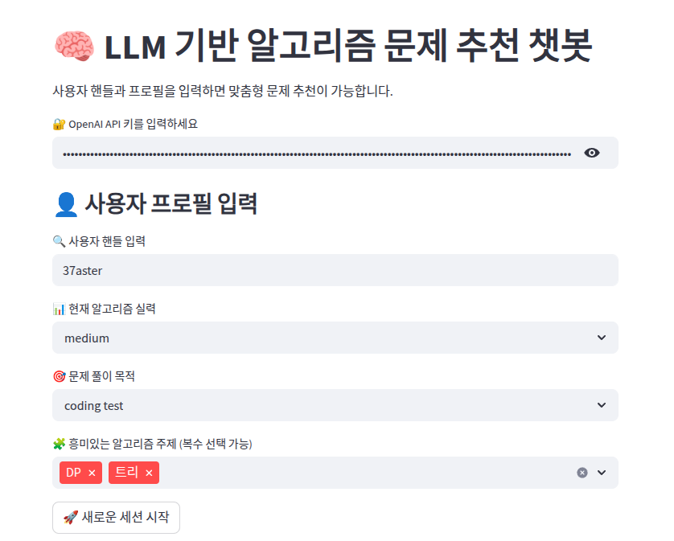
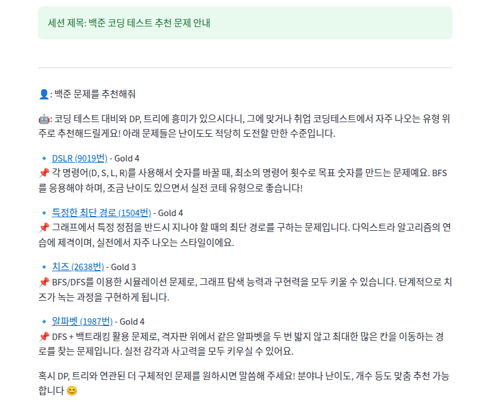
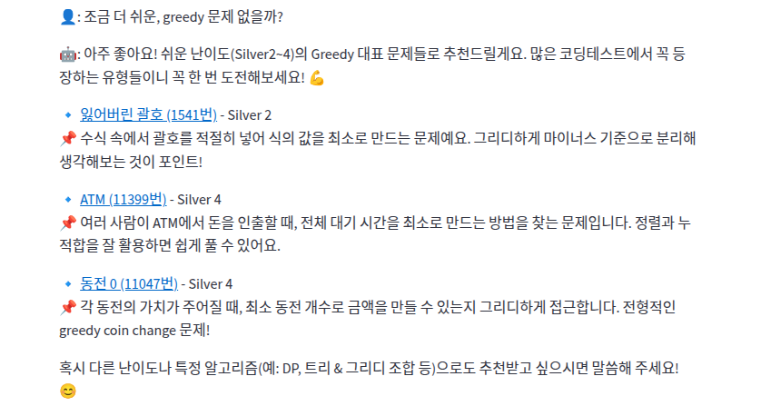
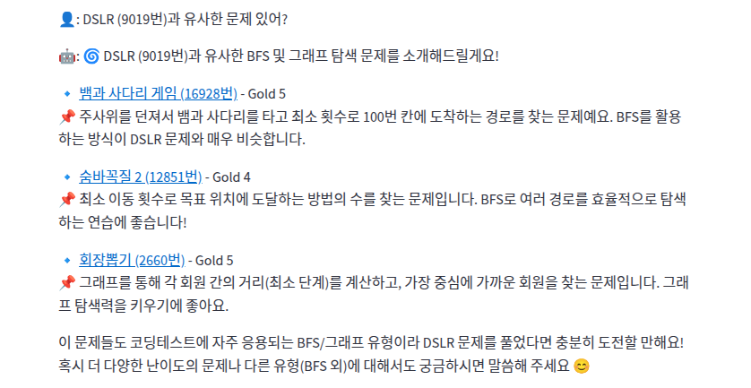
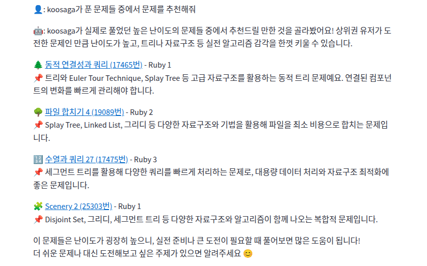

# LLM 기반 대화형 알고리즘 문제 추천 플랫폼

**[Streamlit 데모 바로가기](https://boj-llmrec.streamlit.app)**

> **2025 한국컴퓨터종합학술대회(KCC 2025) 학부생 부분 장려상**

LLM(GPT-4.1)과 협업 필터링 기반 추천 시스템(MultiVAE, LightGCN)을 결합한 대화형 백준 문제 추천 챗봇입니다. 사용자의 풀이 이력과 대화 맥락을 바탕으로 3단계 필터링 파이프라인을 통해 개인화된 문제를 추천합니다.

---

## 데모 화면

### 1. 프로필 설정



OpenAI API 키 입력 후 나타나는 프로필 설정 화면입니다. solved.ac 핸들, 현재 알고리즘 실력(very low ~ very high), 문제 풀이 목적(코딩 테스트·대회·학습·취미), 관심 알고리즘 주제를 설정합니다. 이 정보는 LLM 시스템 프롬프트에 반영되어 추천 방향과 응답 톤을 조정합니다.

---

### 2. 기본 문제 추천



"백준 문제를 추천해줘"처럼 조건 없이 요청하면, MultiVAE가 풀이 이력 기반으로 생성한 후보군에서 프로필(목적·관심 태그)을 반영해 2~4개 문제를 추천합니다. 각 문제는 백준 링크, 난이도, 간단한 설명을 포함하며 세션 제목도 자동으로 생성됩니다.

---

### 3. 조건 필터링 추천



"조금 더 쉬운, greedy 문제 없을까?"처럼 **난이도나 문제 유형**을 대화 중에 언급하면, GPT-4.1이 조건을 자동으로 추출해 후보군을 필터링합니다. 위 예시에서는 Silver 난이도의 Greedy 문제만 선별해 추천하고 있습니다.

---

### 4. 유사 문제 추천



"DSLR(9019번)과 유사한 문제 있어?"처럼 특정 문제 번호를 언급하면, LightGCN이 학습한 문제 임베딩 간 코사인 유사도를 기반으로 비슷한 유형의 문제를 찾아 추천합니다. 같은 알고리즘 개념을 다른 형태로 반복 연습하고 싶을 때 유용합니다.

---

### 5. 다른 유저 풀이 기반 추천



"koosaga가 푼 문제들 중에서 추천해줘"처럼 특정 핸들을 언급하면, solved.ac API로 해당 유저의 top 100 풀이를 가져와 내가 아직 풀지 않은 문제 중 나에게 적합한 문제를 추천합니다. 실력자의 풀이 목록을 벤치마크로 활용하고 싶을 때 사용할 수 있습니다.

---

## 시스템 구조

```
사용자 입력 (핸들 + 프로필 + 메시지)
        │
        ▼
  [Step 1] MultiVAE — 풀이 이력 기반 후보군 생성 (협업 필터링)
        │
        ▼
  [Step 2] GPT-4.1 Function Calling — 태그·난이도 키워드 필터링
        │
        ▼
  [Step 3] GPT-4.1 — 최종 2~4개 문제 자연어 추천
        │
        ├── TTS용 텍스트 변환 (코드 블럭·링크·이모지 제거)
        └── 대화 키워드 추출 (알고리즘 개념 태그)
```

---

## 추천 모드

| 모드 | 호출 예시 | 설명 |
|------|----------|------|
| `recommend` | "백준 문제 추천해줘" | 풀이 이력 기반 개인화 추천 |
| `recommend` + 필터 | "쉬운 greedy 문제 없을까?" | 난이도·유형 조건을 추가한 개인화 추천 |
| `similar` | "9019번과 유사한 문제 있어?" | LightGCN 임베딩 유사도 기반 추천 |
| `user` | "koosaga가 푼 문제 중 추천해줘" | 해당 유저 풀이 중 내가 안 푼 문제 추천 |

태그(`dp && greedy`), 난이도 범위(`min_difficulty`, `max_difficulty`), 페이지네이션(`alternative`) 필터를 GPT-4.1이 대화 맥락에서 자동으로 추출해 적용합니다.

---

## 추천 알고리즘 성능 비교

Baekjoon Online Judge 데이터셋(유저 10,953명, 문제 13,143개, 상호작용 836,469건) 상에서 측정한 결과입니다.

| 모델 | recall@10 | ndcg@10 |
|------|-----------|---------|
| EASE | 0.4565 | 0.5201 |
| **MultiVAE** | **0.4113** | **0.4657** |
| LightGCN | 0.3638 | 0.4177 |
| MF | 0.2926 | 0.3454 |

MultiVAE는 사용자 임베딩을 학습하지 않아 **새로운 유저에 대해 재학습 없이 즉시 추천**이 가능하다는 실용적 장점이 있어 채택하였습니다.

---

## 데이터

학습 데이터는 [solved.ac 공개 API](https://solvedac.github.io/unofficial-documentation/)를 통해 수집하였습니다.

| 파일 | 설명 |
|------|------|
| `data/solved_info.csv` | 유저-문제 상호작용 데이터 |
| `data/problem_info.csv` | 문제 메타데이터 (제목, 태그, 난이도) |
| `data/top_100_for_demo/` | 데모용 유저별 top 100 풀이 캐시 |

---

## 기술 스택

| 분류 | 사용 기술 |
|------|----------|
| UI | Streamlit |
| LLM | OpenAI GPT-4.1 (Function Calling) |
| 추천 모델 | MultiVAE, LightGCN |
| 데이터 수집 | solved.ac API |
| 주요 라이브러리 | PyTorch, Pandas, scikit-learn, pyparsing |

---

## 논문

> 박준하, 박민준, 이성연, 이예준, 하승준, 정영민, "LLM 기반 대화형 알고리즘 문제 추천 플랫폼 설계 및 구현", *2025 한국컴퓨터종합학술대회*, 2025.
>
> [DBpia에서 보기](https://www.dbpia.co.kr/journal/articleDetail?nodeId=NODE12318787&loginYN=C)
